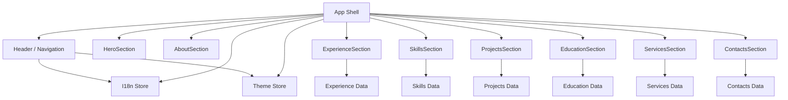
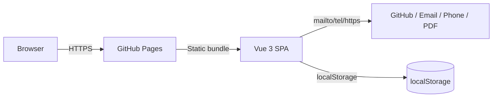

## 1. Описание задачи

- **Проект**: одностраничный сайт‑портфолио Senior Frontend‑разработчика.
- **Фронтенд**: Vue 3 + TypeScript + Sass.
- **Архитектура фронтенда**: Feature‑Sliced Design (FSD) — уровни `app`, `pages`, `widgets`, `features`, `entities`, `shared`.
- **Backend**: отсутствует на первом этапе (только статический фронтенд).
- **Локализация**: сразу две локали — `ru` и `en`, с переключателем языка.
- **Тема**: светлая/тёмная, переключатель с сохранением в `localStorage`.
- **Хостинг**: статический — GitHub Pages, репозиторий `portfolio` (база билда `/portfolio/`).

Все юзер‑кейсы из ТЗ (`tasks/tz_portfolio.md`) реализуются внутри одного SPA с плавной прокруткой по секциям.

## 2. Функциональная архитектура

### 2.1. Функциональные компоненты

#### Компонент: Навигация и layout

- **Назначение**: обеспечивает каркас страницы, хедер, футер, навигацию по секциям, переключатели языка и темы.
- **Функции:**
  - `renderLayout()`  
    - Вход: текущая локаль, текущая тема, конфигурация секций.  
    - Выход: разметка страницы с хедером, секциями и футером.  
    - Связанные UC: UC‑01, UC‑02, UC‑08, UC‑09.
  - `scrollToSection(sectionId)`  
    - Вход: идентификатор секции (`about`, `experience`, `skills`, `projects`, `education`, `services`, `contacts`).  
    - Выход: плавная прокрутка к секции.  
    - Связанные UC: UC‑02.
  - `highlightActiveSection()`  
    - Вход: позиция скролла.  
    - Выход: обновлённое состояние активного пункта меню.  
    - Связанные UC: UC‑02.

#### Компонент: Контентные секции

Для каждой секции — отдельный виджет:

- `HeroSection` — главный экран (имя, позиция, CTA).  
  - Функции: отрисовать данные профиля, отдать CTA‑события (скачать резюме, открыть e‑mail, GitHub).  
  - Юзер‑кейсы: UC‑01, UC‑08, UC‑10.

- `AboutSection` — «Обо мне».  
  - Функции: показать короткое резюме кандидата.  
  - Юзер‑кейсы: UC‑03.

- `ExperienceSection` — опыт (таймлайн).  
  - Функции: отрисовать опыт в виде вертикального списка/таймлайна, раскрывать детали по клику.  
  - Юзер‑кейсы: UC‑04.

- `SkillsSection` — навыки и стек.  
  - Функции: сгруппировать навыки по категориям, отрисовать теги/бейджи.  
  - Юзер‑кейсы: UC‑06.

- `ProjectsSection` — проекты (на первом этапе: плейсхолдер/карточка «Проекты скоро будут»).  
  - Функции: отображать карточки проектов (структурно готово, но данные могут быть пустыми).  
  - Юзер‑кейсы: UC‑05 (частично: структура и UI, реальные проекты добавятся позже).

- `EducationSection` — образование и курсы.  
  - Функции: отрисовать ВУЗ + список курсов/сертификатов.  
  - Юзер‑кейсы: UC‑07.

- `ServicesSection` — блок «Услуги / Чем могу быть полезен».  
  - Функции: показать перечень типов задач, которые вы выполняете (разработка SPA, миграции, аудит фронтенда и т.п.).  
  - Юзер‑кейсы: расширение UC‑03 и UC‑05, отдельный бизнес‑блок.

- `ContactsSection` — контакты и быстрые действия.  
  - Функции: отрисовать контакты (телефон, e‑mail, GitHub, город), навигационные CTA.  
  - Юзер‑кейсы: UC‑08, UC‑10.

#### Компонент: Локализация (i18n)

- **Назначение**: хранение словарей для `ru` и `en`, выбор и переключение языка.
- **Функции:**
  - `setLocale(locale)`  
    - Вход: `'ru' | 'en'`.  
    - Выход: обновлённое глобальное состояние локали и сохранение в `localStorage`.  
    - Юзер‑кейсы: все (все тексты должны отображаться в выбранной локали).
  - `t(key)`  
    - Вход: строковый ключ (`'nav.about'`, `'hero.title'` и т.п.).  
    - Выход: строка перевода для текущей локали.  
    - Юзер‑кейсы: все.

#### Компонент: Темизация

- **Назначение**: управление темой (light/dark), применение CSS‑переменных.
- **Функции:**
  - `setTheme(theme)`  
    - Вход: `'light' | 'dark'`.  
    - Выход: обновлённые CSS‑переменные на корневом элементе и сохранение значения в `localStorage`.  
    - Юзер‑кейсы: UC‑09.
  - `initThemeFromSystemOrStorage()`  
    - Вход: `localStorage`, media‑запрос `prefers-color-scheme`.  
    - Выход: стартовая тема.  
    - Юзер‑кейсы: UC‑09.

#### Компонент: Анимации и наблюдение за секциями

- **Назначение**: единый механизм появления секций при скролле.
- **Функции:**
  - `useInViewAnimation(target)`  
    - Вход: ref DOM‑элемента.  
    - Выход: реактивное состояние «в зоне видимости», классы для анимации.  
    - Юзер‑кейсы: UC‑01–UC‑10 (анимации вспомогательные).

### 2.2. Диаграмма функциональных компонентов (упрощённо)



## 3. Системная архитектура

### 3.1. Архитектурный стиль

- **Стиль**: клиентский монолит (SPA) на Vue 3 + Vite.
- **Обоснование**:
  - Объём функциональности небольшой, нет сложных интеграций.
  - Требуется быстрый старт и простой деплой на GitHub Pages.
  - Нет backend‑логики, всё ограничивается отрисовкой и лёгкой интерактивностью.

### 3.2. Компоненты системы

#### Компонент: SPA‑клиент

- **Тип**: Frontend (Vue 3 SPA).
- **Назначение**: реализация всех юзер‑кейсов ТЗ.
- **Технологии**:
  - Язык: TypeScript.
  - Фреймворк: Vue 3 (Composition API + `<script setup>`).
  - Сборка: Vite.
  - Стили: Sass (SCSS‑синтаксис), CSS‑переменные для темизации.
- **Интерфейсы**:
  - Входящие:
    - HTTP‑запрос от браузера к статическому бандлу.
    - Взаимодействие пользователя (клики, скролл, resize).
  - Исходящие:
    - Переходы на внешние ресурсы (GitHub, mailto, tel, PDF‑файл резюме).
- **Зависимости**:
  - Браузерный DOM/History API для работы с якорями.
  - `localStorage` для хранения настроек темы и языка.

#### Компонент: Статический хостинг (GitHub Pages)

- **Тип**: хостинг статического контента.
- **Назначение**: отдача собранного бандла (`dist`) по HTTPS.
- **Технологии**:
  - GitHub Pages (ветка `gh-pages` или `docs/` — будет уточнено на этапе деплоя).
- **Интерфейсы**:
  - HTTP(S) на стороне клиента.
- **Особенности**:
  - Путь базы должен быть настроен (`base: '/portfolio/'` в `vite.config.ts`).

### 3.3. Диаграмма компонентов (упрощённо)



## 4. Модель данных

### 4.1. Концептуальная модель

Основные сущности, которые будут представлены как TypeScript‑типы и конфигурационные объекты.

#### Сущность: PersonProfile

- **Описание**: базовая информация о кандидате.
- **Атрибуты:**
  - `fullName: string`
  - `position: string` — целевая позиция (Senior Frontend Developer).
  - `location: string`
  - `salaryExpectationUSD: number`
  - `summary: LocalizedText` — «Обо мне» (ru/en).

#### Сущность: ExperienceItem

- **Описание**: запись об опыте.
- **Атрибуты:**
  - `company: string`
  - `location?: string`
  - `position: string`
  - `start: string` — ISO‑дата или `YYYY-MM`.
  - `end?: string` — `YYYY-MM` или `null` для текущей позиции.
  - `description: LocalizedText`
  - `projects?: ExperienceProject[]`

#### Сущность: ExperienceProject

- **Атрибуты:**
  - `name: LocalizedText`
  - `description: LocalizedText`
  - `techStack: string[]`
  - `githubUrl?: string`
  - `liveUrl?: string`

#### Сущность: SkillCategory / Skill

- `SkillCategory`:
  - `id: string`
  - `title: LocalizedText`
  - `skills: Skill[]`
- `Skill`:
  - `name: string`
  - `level?: 'core' | 'confident' | 'familiar'`

#### Сущность: EducationItem / CourseItem

- `EducationItem`:
  - `institution: string`
  - `degree: LocalizedText`
  - `faculty: LocalizedText`
  - `year: number`
- `CourseItem`:
  - `title: LocalizedText`
  - `provider: string`
  - `year: number`
  - `certificateUrl?: string`

#### Сущность: ServiceItem

- **Описание**: типы услуг, которые вы оказываете.
- **Атрибуты:**
  - `title: LocalizedText`
  - `description: LocalizedText`

#### Сущность: ContactInfo

- **Атрибуты:**
  - `phone: string`
  - `email: string`
  - `githubUrl: string`
  - `location: string`

#### Вспомогательная сущность: LocalizedText

- `LocalizedText`:
  - `ru: string`
  - `en: string`

### 4.2. Логическая модель данных

Хранение данных — в виде модулей с экспортируемыми константами (без БД).

- `src/entities/person/model/profile.ts` — `PersonProfile`.
- `src/entities/experience/model/experience.ts` — список `ExperienceItem[]`.
- `src/entities/skills/model/skills.ts` — `SkillCategory[]`.
- `src/entities/education/model/education.ts` — `EducationItem[]`, `CourseItem[]`.
- `src/entities/services/model/services.ts` — `ServiceItem[]`.
- `src/entities/contacts/model/contacts.ts` — `ContactInfo`.

Для EN‑версии используются поля `LocalizedText`, а не отдельные структуры.

### 4.3. Диаграмма модели данных (упрощённо)

```text
PersonProfile
  - fullName
  - position
  - summary (LocalizedText)
  - ...

ExperienceItem 1..N ---> ExperienceProject 0..N
SkillCategory 1..N ---> Skill 1..N
EducationItem 1..N
CourseItem 1..N
ServiceItem 1..N
ContactInfo (1)
```

### 4.4. Миграции и версионирование

- Так как используется только фронтенд без БД, «миграции» сводятся к:
  - обновлению структур типов в `shared/types` и `entities/*/model`;
  - последовательному обновлению потребляющих компонентов.
- Для изменений, ломающих типы, используется стандартный подход TypeScript (ошибки компиляции помогают найти места использования).

## 5. Интерфейсы

### 5.1. Внешние интерфейсы

- **HTTP‑интерфейс**:
  - Отдача статических файлов (`index.html`, JS/CSS/asset‑бандлы) GitHub Pages.
- **Переходы**:
  - `mailto:` для e‑mail.
  - `tel:` для телефона.
  - `https://github.com/UruBad` для GitHub‑профиля.
  - Статический `resume.pdf` из `public/` (или аналогичного каталога) для скачивания резюме.

### 5.2. Внутренние интерфейсы

- **Навигация ↔ секции**:
  - Навигация (виджет `Header`) вызывает `scrollToSection(id)` из shared‑утилит.
  - Секции помечены `id` и регистрируются для наблюдения (IntersectionObserver).
- **Хранилища (stores)**:
  - `useThemeStore()` и `useI18nStore()` реализованы как composable‑хуки с использованием `ref`/`computed` и `provide/inject` на уровне `app`.

## 6. Стек технологий

- **Фреймворк**: Vue 3 (Composition API, `<script setup>`).
- **Сборка**: Vite.
- **Язык**: TypeScript.
- **Стили**: Sass (SCSS), CSS‑переменные для темизации.
- **Иконки/UI**: кастомные компоненты кнопок и иконок на основе SVG, без тяжёлых UI‑библиотек.

Обоснование:
- Небольшой проект, нужен быстрый билд и DX — Vite + Vue 3 подходят оптимально.
- Отсутствие лишних сторонних UI‑библиотек упрощает поддержку и контроль над дизайном.

## 7. Безопасность

Так как нет backend‑логики и пользовательских данных, требования к безопасности минимальны:

- Контент статический, нет ввода данных пользователем.
- Защита сводится к:
  - корректной конфигурации GitHub Pages (HTTPS по умолчанию);
  - отсутствию небезопасных inline‑скриптов.

## 8. Масштабируемость и производительность

- Масштабирование по нагрузке фактически не требуется (портфолио, не high‑load).
- Оптимизации:
  - бандл разбит Vite по умолчанию;
  - тяжёлые изображения/ассеты по возможности оптимизируются (SVG/modern formats).

## 9. Надёжность и отказоустойчивость

- Главная цель — чтобы сайт корректно загружался и оставался функциональным даже при частичных ошибках (например, недоступен `resume.pdf`).
- Обработка ошибок:
  - для ссылки на PDF — отображение пользовательского сообщения вместо падения SPA.

## 10. Развёртывание

### 10.1. Окружения

- **Development**: локальный запуск через `npm run dev`.
- **Production**: GitHub Pages, статический бандл из `dist`.

### 10.2. CI/CD (минимальный)

- GitHub Actions (позже):
  - шаги: `checkout`, `setup-node`, `npm ci`, `npm run build`, деплой на GitHub Pages.

### 10.3. Конфигурация

- `vite.config.ts`:
  - `base: '/portfolio/'` для корректной работы на GitHub Pages.

## 11. Открытые вопросы

1. Нужно ли на первом этапе добавлять любые формы (например, форма обратной связи, отправляющая письмо через сторонний сервис), или достаточно статических контактов? (по умолчанию — **только статические контакты**).
2. Нужны ли какие‑то базовые метрики (например, подключение Google Analytics / Yandex Metrica) на первом этапе, или это будет добавлено позже?

